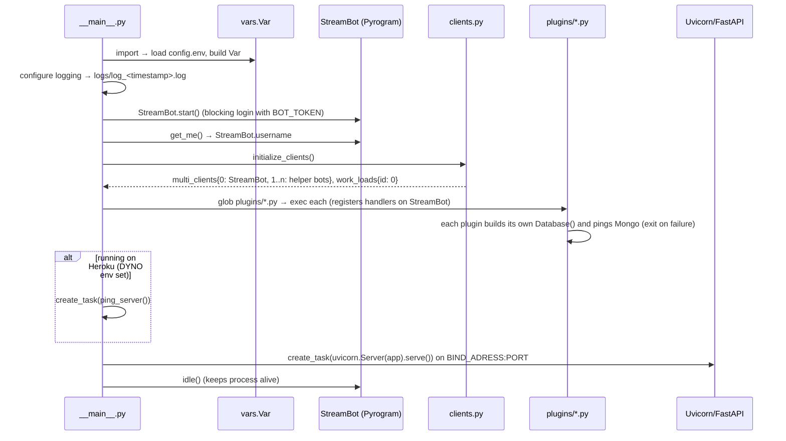

# File-To-Link Bot — Architecture & Flow

> Snapshot of the code as of commit `94a2e47` ("code refactor"), written 2026-10-03.
> Origin: fork of `adarsh-goel/filestreambot-pro` / `Aadhi000/File-To-Link`; package name is `Adarsh`.

## 1. What it does

A Telegram bot that turns any file a user sends it into **permanent HTTP links**:

- **Download link** — `{URL}{msg_id}/?hash={hash}` streams the raw bytes (supports HTTP `Range`, so players can seek and downloads can resume).
- **Watch link** — `{URL}watch/{msg_id}/?hash={hash}` serves a small HTML page with a `<video>` / `<audio>` player (or a download page for other file types).

The file is **never stored on this server**. The bot forwards the user's file into a private Telegram "bin" channel (`BIN_CHANNEL`), and the web server streams the bytes from Telegram's servers on demand, chunk by chunk.

## 2. Tech stack

| Concern | Tech |
|---|---|
| Telegram client | Pyrogram 2.0.106 (+ TgCrypto), bot-token login |
| Web server | FastAPI + Uvicorn (run inside the bot's asyncio loop) |
| Database | MongoDB via Motor (async) — stores users + login passwords |
| HTTP client | aiohttp (keep-alive ping, content-length probe) |
| Config | `python-dotenv` reading `config.env` (or real env vars) |
| Sys stats | psutil |

## 3. Repository layout

```
Adarsh/
  __init__.py            StartTime, __version__ (1.1)
  __main__.py            Entry point: logging, start bot, load plugins, start web server
  vars.py                `Var` class — all configuration read from env
  bot/
    __init__.py          Creates `StreamBot` Pyrogram client; shared `multi_clients`, `work_loads`
    clients.py           Starts extra helper bots (MULTI_TOKEN_n) for load balancing
    plugins/
      start_help.py      Auth middleware + /start /help /about
      stream.py          File/media handlers (private chat + channel), /login
      admin.py           /users and /broadcast (owner only)
      extra.py           /stats (uptime, disk, CPU, RAM, network)
  server/
    __init__.py          FastAPI app, CSV request-logging middleware, /favicon.ico
    stream_routes.py     Routes: `/`, `/watch/...`, `/{id}` + the range-aware media_streamer
    exceptions.py        InvalidHash, FIleNotFound
  utils/
    custom_dl.py         ByteStreamer: talks to Telegram DCs and yields file chunks
    file_properties.py   Extract media/file_id/hash/name/size from a Message
    database.py          Motor `Database` wrapper + `get_mongo_uri()`
    render_template.py   Builds the watch/download HTML page
    broadcast_helper.py  Forward-to-user with error classification
    keepalive.py         Periodic self-ping (Heroku/Railway only)
    config_parser.py     Reads MULTI_TOKEN_* env vars
    human_readable.py / time_format.py   formatting helpers
  template/req.html, dl.html   HTML for video/audio and download pages
utils/formatting.py      Size / duration formatting used by /stats
  utils/access.py          Access rules, bans, history, limits, invites, access groups, revoked links
  utils/link_expiry.py     Automatic link expiry (default + per-user lifetime)
  utils/logging_config.py  Logging setup (info.log + error.log, rotation, levels)
start_bot.py / run_tracemalloc.py   Alternative launchers (plain / with memory profiling)
Procfile, app.json, process.json    Heroku / PM2 deploy descriptors
```

Untracked scratch files `solution_distances.py` and `solution_distances_v2.py` are an unrelated coding-challenge solution and are **not part of the bot**.

## 4. Startup sequence (`python -m Adarsh`)



Notes:
- Plugins are loaded manually with `importlib` (not Pyrogram's `plugins=` option), after the clients are up.
- If MongoDB is unreachable, `Database.initialize()` calls `sys.exit(1)` and the whole bot stops.

## 5. Flow A — user sends a file → links are generated

Handler: `stream.py → private_receive_handler` (group 4), filter: private chat + document/video/audio/photo.

```mermaid
flowchart TD
    U[User sends file in private chat] --> MW{start_help.check_user<br/>middleware, group -1}
    MW -- not trusted & not in USER_GROUP_ID --> DENY[Reply 'Access Denied'<br/>StopPropagation]
    MW -- allowed --> H[private_receive_handler]
    H --> PW{MY_PASS set?}
    PW -- yes, user not logged in --> LOGIN[Reply: use /login]
    PW -- no / ok --> NEWU{User in Mongo?}
    NEWU -- no --> ADD[add_user + notify BIN_CHANNEL '#NEW_USER']
    NEWU -- yes --> UPD
    ADD --> UPD{UPDATES_CHANNEL set?}
    UPD -- not a member --> JOIN[Ask user to join channel]
    UPD -- ok --> FWD[Forward message to BIN_CHANNEL → log_msg]
    FWD --> LINK[hash = file_unique_id[:6]<br/>build watch + download URLs]
    LINK --> NOTE[Post 'requested by' note under log_msg in BIN_CHANNEL]
    NOTE --> REPLY[Reply to user with name, size, 2 links + buttons]
```

Channel flow (`channel_receive_handler`, group -1): when the bot is admin in a channel and a non-forwarded document/video/photo is posted, it forwards to `BIN_CHANNEL`, then **edits the original channel post** to attach Watch/Download inline buttons. Channels in `BANNED_CHANNELS` make the bot leave the chat.

## 6. Flow B — someone opens a link → bytes are streamed

Routes live in `server/stream_routes.py`.

```mermaid
flowchart TD
    R[GET /{id}?hash=xxxxxx<br/>or /{hash}{id}] --> PARSE[Regex: extract message id + 6-char hash]
    PARSE --> PICK[Pick client with the lowest work_loads value]
    PICK --> BS[Get/create cached ByteStreamer for that client]
    BS --> FP[get_file_properties: get_messages BIN_CHANNEL,id<br/>cache FileId in memory]
    FP --> CHK{file_unique_id[:6] == hash?}
    CHK -- no --> E403[403 Invalid hash]
    CHK -- yes --> RNG[Parse Range header<br/>compute offset / chunk size / part count / cuts]
    RNG --> GEN[yield_file: work_loads[i]++<br/>open media Session to file's DC<br/>loop upload.GetFile chunk by chunk]
    GEN --> RESP[StreamingResponse 200 or 206<br/>Content-Range, Accept-Ranges, Content-Disposition]
    GEN --> DONE[finally: work_loads[i]--]
```

Key details in `media_streamer`:
- **Chunking** (`custom_dl.chunk_size`): `2^clamp(ceil(log2(len/1024)), 2, 10) * 1024` → between 4 KiB and 1 MiB, scaled to the request length. `offset_fix` aligns the start offset down to a chunk boundary; `first_part_cut` / `last_part_cut` trim the first/last chunk to the exact requested bytes.
- **Media sessions**: Telegram files live on specific data centres. If the file's DC differs from the bot's home DC, `generate_media_session` creates a new auth key and imports authorization (up to 6 retries); sessions are cached per client per DC.
- **Caches**: `ByteStreamer.cached_file_ids` is wiped every 30 min; `class_cache` maps client → ByteStreamer.
- **Photos** are returned as `image/jpeg` with a generated timestamped file name; unknown types fall back to `application/octet-stream`. File names are ASCII-sanitised for the header.
- **Watch page** (`render_template.render_page`): for `video/*` and `audio/*` uses `req.html`; for everything else it makes an HTTP request to its own download URL to read `Content-Length`, then renders `dl.html`.
- **Status endpoint** `GET /` returns JSON: uptime, bot username, number of connected bots, per-bot load, version.

## 7. Multi-client load balancing

Set `MULTI_TOKEN_1..n` env vars with extra bot tokens. `initialize_clients()` starts each as a **no-updates** Pyrogram client (`memory_<n>` session files) and registers it in `multi_clients` with `work_loads[n] = 0`. Each stream request picks `min(work_loads)`; the counter is incremented while a response is being generated and decremented in `finally`. This spreads Telegram flood limits across several bot accounts. `StreamBot` (id 0) is the only one receiving updates. The extra bots must also be admins of `BIN_CHANNEL` to read messages.

## 8. Bot commands & handler groups

| Command / trigger | File | Access | Behaviour |
|---|---|---|---|
| any private message | start_help.py `check_user` (group -1) | everyone | Auth middleware — see §9 |
| `/start` | start_help.py | allowed users | Register user; welcome photo, or (deep link `/start <msgid>`) re-send link for a BIN_CHANNEL message |
| `/help`, `/about` | start_help.py | allowed users | Static help / about cards |
| file/photo/audio/video in private | stream.py (group 4) | allowed users (+login if `MY_PASS`) | Generate links (Flow A) |
| `/login` or "login🔑" | stream.py (groups 4 + 3) | allowed users, private chat only | Prompt for `MY_PASS` (next message within 90 s, then deleted), store in Mongo `ag_passwords` DB |
| media posted in a channel | stream.py (group -1) | bot must be channel admin **and** a human admin of the channel must have bot access | Forward to bin + add buttons; counts against that admin's limit |
| `/users` | admin.py | `OWNER_ID` | Total users in DB |
| `/broadcast` (reply to a message) | admin.py | `OWNER_ID` | Forward replied message to every user; failures (400) delete the user; log file sent if any failure |
| `/stats` | extra.py | **any private user** | Uptime, disk, network, CPU/RAM |

## 9. Authorization middleware (added in commit `529a82f`)

`start_help.check_user` (group `-1`) runs for every private message and calls `utils/access.py → has_access()`:

1. `Var.USER_GROUP_ID` falsy → everyone allowed.
2. `OWNER_ID` / `TRUSTED_USERS` → allowed (also exempt from usage limits).
3. Explicitly **banned** in `access_users` → denied (beats everything).
4. Explicitly **approved** (via request button, invite or admin) → allowed.
5. Current member (owner/admin/member) of any **access group** → allowed. Access groups = `USER_GROUP_ID` (if it is a negative chat id) + groups enabled in the admin menu. Left/banned members do not count; membership results are cached 60 s.
6. Has **asked to join** an access group (recorded by `on_chat_join_request`, plus a startup backfill) → allowed before approval. Needs the bot to be an admin of the group with the "Invite users" right.
7. Otherwise: "Access Denied" with a **🔑 Request Access** button (or "pending" / "banned" notices) and `StopPropagation`.

Deep link `/start inv_<token>` is handled inside the middleware so invitees without access can redeem it.

### Access requests, admin menu, invites, limits (`bot/plugins/access_admin.py`)

- **Request flow:** user taps *Request Access* (a rejected or revoked person must wait 1 hour before asking again) → status `pending` → every owner gets a message with ✅ Approve / ❌ Reject / 🚫 Ban → the user is notified of the decision.
- **`/admin`** (owners only) opens an inline menu:
  - *Invite a person* — by @username/ID (bot DMs an Accept button; if the DM fails you get a link to send) or a single-use 7-day link with a Share button.
  - *Users* — everyone with access, **most recently active (last bot use) first**, never-used last, paginated; people who got in only via a group appear with status `group`; open one to Revoke / Ban / Unban / set limit / see per-user history and usage counts.
  - *Pending* — outstanding requests.
  - *Groups* — pick a chat the bot is already in (learned from membership updates and seen messages) or add by ID; remove to stop granting access.
  - *Default limit* and per-user limits; *History* of every decision.
- **Nothing is ever posted to an access group/channel:** they are only queried with `get_chat_member` / `get_chat_join_requests`. The existing channel auto-button handler (`channel_receive_handler`) now skips access chats.
- **Revoking a file:** `/revoke <message id>` (owners) stops serving that file everywhere; `/unrevoke <message id>` restores it. New links carry a 12-character hash; older 6-character links still work.
- **Limits:** N links per hour / day / week / month (rolling windows), lifetime total, or unlimited. A personal limit overrides the default. Enforced in `stream.py` before a file is forwarded; usage is recorded only after links are sent. Owners and trusted users are exempt.

## 10. Data stored

**MongoDB** (database name = `SESSION_NAME`, default `filetolinkbot`; second DB `ag_passwords`), collection `users`:

```json
{ "id": 123456789, "join_date": "2026-10-03", "ag_p": "<MY_PASS, only if logged in>" }
```

Access collections (same database): `access_users` (status: pending/approved/rejected/revoked/banned, profile, granted_at/by/source, optional `quota`), `access_history`, `access_usage`, `access_chats`, `access_invites`, `access_settings`, `join_requests` (`{id, requested_on}`).

**On disk:** `logs/log_<timestamp>.log` (one per run), `logs/request_logs.csv` (timestamp, IP, full URL of every web request), Pyrogram `*.session` files (git-ignored), `broadcast.txt` (temporary).

## 11. Configuration (`Adarsh/vars.py`)

Loaded from `config.env`. Values are secrets — **never commit** (`config.env` and `*.session` are already in `.gitignore`).

| Variable | Required | Default | Purpose |
|---|---|---|---|
| `API_ID`, `API_HASH`, `BOT_TOKEN` | yes | – | Telegram credentials |
| `BIN_CHANNEL` | yes | – | Private channel used as file storage |
| `OWNER_ID` | recommended | empty | Space-separated owner ids (admin commands) |
| `OWNER_USERNAME` | no | `"None"` | Shown on startup |
| `PORT` / `WEB_SERVER_BIND_ADDRESS` | no | 8080 / 0.0.0.0 | Web server |
| `FQDN`, `HAS_SSL`, `NO_PORT` | no | bind address / false / false | Public URL composition |
| `SESSION_NAME` | no | `filetolinkbot` | Mongo DB name |
| `WORKERS`, `SLEEP_THRESHOLD` | no | 3 (second assignment wins), 60 | Pyrogram tuning |
| `MULTI_TOKEN_n` | no | – | Extra helper bots |
| `MONGO_SCHEMA/USERNAME/PASSWORD/HOST/PORT` | yes | – / – / – / 127.0.0.1 / 27017 | MongoDB (`mongodb` or `mongodb+srv`) |
| `MY_PASS` | no | none | Enables password-gated usage |
| `UPDATES_CHANNEL` | no | `"None"` | Force-subscribe channel |
| `BANNED_CHANNELS` | no | one hard-coded id | Channels the bot leaves |
| `USER_GROUP_ID`, `TRUSTED_USERS` | see risks | 1 / – | Access-control middleware |
| `PING_INTERVAL` | no | 1200 | Keep-alive period (Heroku only) |
| `LOG_LEVEL` | no | INFO | DEBUG / INFO / WARNING / ERROR |
| `LOG_LIBS_LEVEL`, `LOG_DIR`, `LOG_MAX_MB`, `LOG_BACKUPS` | no | WARNING / logs / 5 / 3 | Library log level, folder, rotation size and copies kept |

## 12. Deployment options

- **Local / VPS:** `python -m Adarsh` (or `python start_bot.py`; `run_tracemalloc.py` for memory profiling).
- **Heroku/Railway:** `Procfile` (`web: python -m Adarsh`), `app.json` form. Presence of `DYNO` flips `ON_HEROKU` which enables keep-alive pinging and https links.
- **PM2:** `process.json` — currently contains a hard-coded Windows Anaconda interpreter path.

## 13. Known issues & risks found while reading the code

Ordered roughly by impact. None of these have been changed yet.

1. **`requirements.txt` is missing `fastapi` and `uvicorn`** (both imported by the server) — a clean install fails to start.
2. **`TRUSTED_USERS` unset crashes startup:** `''.split(" ")` → `['']` → `int('')` raises `ValueError` in `vars.py`.
3. **`USER_GROUP_ID` defaults to `1` (truthy):** if unset, the middleware tries `get_chat_member(1, …)`, fails, and denies everyone except trusted users. `OWNER_ID` users are *not* exempt unless also in `TRUSTED_USERS`.
4. **`UPDATES_CHANNEL` defaults to the string `"None"`**, and `start_help.py` tests `is not None` (always true) — the force-subscribe branch runs, errors, and falls into the generic "Welcome" reply, so `/start`, `/help`, `/about` likely never show their real content when the variable is unset. `stream.py` correctly compares to `"None"`.
5. **`/login` needs `pyromod`** (`c.listen`), but the `import pyromod.listen` line in `bot/__init__.py` is commented out → login fails (error is swallowed by `print`). Currently masked because `MY_PASS` is not set.
6. **Link security:** the "hash" is only the first 6 characters of Telegram's `file_unique_id`; anyone with a message id and a guess can probe. Links never expire.
7. **`broadcast_helper.send_msg`:** after `FloodWait` it does `return send_msg(...)` without `await` (returns a coroutine, not a status tuple) and uses `e.x`, which Pyrogram 2.x renamed to `e.value`. Same `e.x` usage in `stream.py` FloodWait handlers.
8. **Request log CSV** is written with blocking file I/O inside an async middleware and records full URLs (which include the hash). Grows without bound.
9. **Log files accumulate:** a new `logs/log_*.log` per start; `backupCount` has no effect without `maxBytes` (and `logs/` already holds a very large number of files).
10. **Four `Database` instances** (admin, start_help, stream ×2) each open their own Mongo client and each can `sys.exit(1)`; duplicate boilerplate.
11. **`/stats` has no owner restriction**, leaking server resource info to any allowed user. README lists the command as `status`.
12. **`stream.py`**: `m.reply_text(e)` passes an exception object; `Content-Range` header is also sent on non-range 200 responses; `except (TimeoutError, AttributeError): pass` in `yield_file` silently truncates streams (see `unknown_errors.txt`: recurring `503 Timedout upload.GetFile`).
13. **`bool(getenv('NO_PORT', False))` / `HAS_SSL`:** any non-empty string, including `"false"` or `"0"`, evaluates to `True`.
14. **Housekeeping:** duplicate `WORKERS` assignment; duplicate `readable_time`/`get_readable_time` helpers; `utils_bot.py` lives outside the package; sonar/coverage config are placeholders; README/branding still points at the original author's channels and PayPal; unused `file_size.py`.

## 14. Link expiry

Module: `Adarsh/utils/link_expiry.py` (self-contained; the rest of the code only calls `register()` when a link is created and `is_expired()` when one is opened).

- **Default is unlimited.** Owners set a default lifetime for everyone and an optional personal lifetime per user in `/admin` → *Link expiry* (presets 1 h / 6 h / 1 d / 7 d / 30 d, custom such as `90m`, `12h`, `3d`, `2w`, `1d12h`, or unlimited). A personal setting overrides the default; "Use default" removes it.
- **When it applies:** the lifetime in force when a link is created is stored with the link (collection `access_links`: message id, owner of the link, expiry time). Changing the setting later does not touch existing links; links created while the lifetime was unlimited, and all older links, never expire.
- **What happens:** an expired link returns `410 Gone` for both the download and the watch page (only after the link's hash is verified, so nothing is revealed to guessers); the `/start <id>_<hash>` deep link reports it as invalid. The bot's reply to the user says "This link expires in …" instead of "permanent".
- **Channels:** posts in a channel use the lifetime of the channel admin that is charged for the usage.
- **Resilience:** answers are cached for 60 s; if the database cannot be reached the last known answer is used (or the link is treated as unlimited) so downloads do not break.
- Expired records are kept on purpose: deleting one would make the link live again.

## 15. Logging

Configured once in `Adarsh/utils/logging_config.py`, called from `__main__.py`; every module uses a named logger (`Adarsh.<package>.<module>`), no `print()` outside the start-up banner.

| File (in `logs/`) | Contents |
|---|---|
| `info.log` | DEBUG and INFO records (DEBUG only if `LOG_LEVEL=DEBUG`) |
| `error.log` | WARNING, ERROR, CRITICAL (also copied to stderr at ERROR and above) |

Both rotate at `LOG_MAX_MB` (default 5 MB) and keep `LOG_BACKUPS` (default 3) old copies, so the worst case is about 40 MB. Libraries (pyrogram, uvicorn, motor, …) are held at `LOG_LIBS_LEVEL` (default WARNING). Per-message database chatter is DEBUG, so at the default **INFO** level the files stay small. The request log (`<LOG_DIR>/request_logs.csv`, one row per web request) rotates **monthly**: the current month stays in `request_logs.csv`, and on the first request of a new month it is renamed to `request_logs_YYYY-MM.csv` and a fresh file with a header is started. Nothing is deleted. It is written from a worker thread so the event loop is never blocked, and a failure to write never fails the request. Implementation: `Adarsh/utils/request_log.py`. The old one-file-per-start `log_*.log` files are no longer created.

New configuration keys: `LOG_LEVEL`, `LOG_LIBS_LEVEL`, `LOG_DIR`, `LOG_MAX_MB`, `LOG_BACKUPS`. A sanitised `config.env.example` lists every key.

## 16. Housekeeping done on 2026-10-04

- Deleted the 51,786 per-start run logs older than 7 days (145 MB); kept the last 7 days and all of `request_logs.csv`.
- Trimmed the bot's pm2 output/error logs to their last 20,000 lines.
- Removed 8 duplicate rows from the `users` collection (they only held a join date) and created the unique index on `users.id`; the removed rows were saved to a backup file first.
- Split the old 59 MB request log into 16 monthly files plus the current month (692,656 rows; every closed month was checked against the row counts taken before the split). The tests had briefly appended 322 rows of their own to the live file; those rows (IP `testclient`) were removed, and the tests now write only to a temporary folder.
